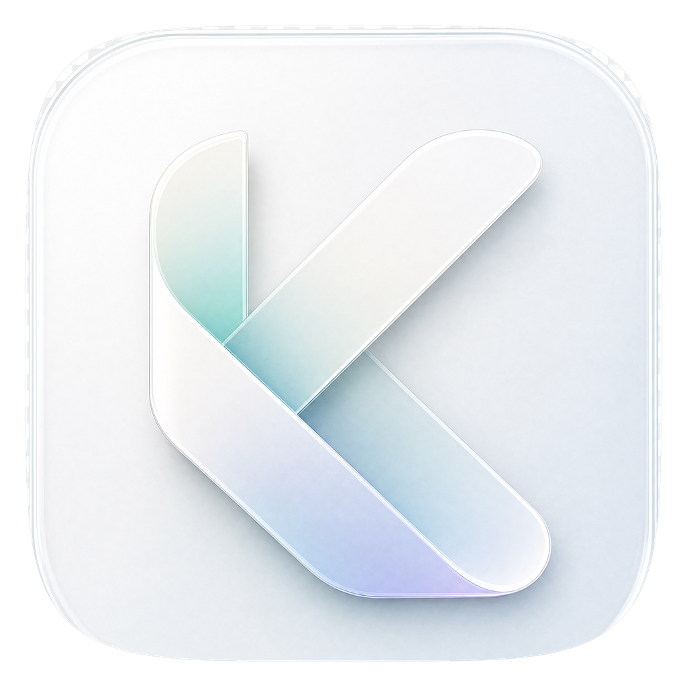
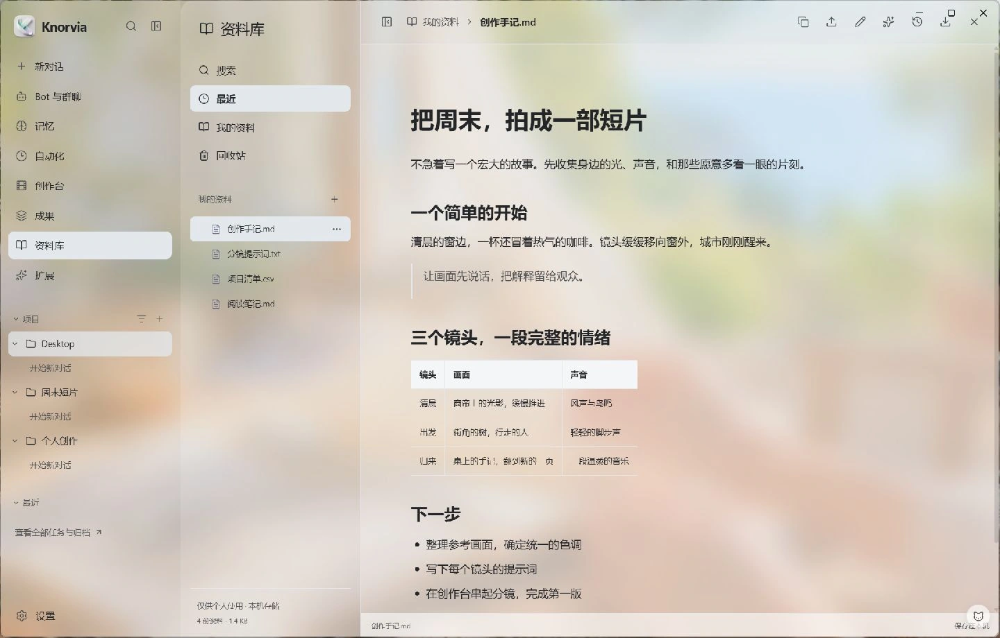

<p align="center"></p>

# Knorvia

**你的个人 AI 工作台。连接模型、资料与工具，把想法做成作品。**

[产品网站](https://knorvia.xyz) · [公开下载](https://github.com/accomplish-zrh/Knorvia/releases/latest) · [更新记录](CHANGELOG.md) · [参与贡献](CONTRIBUTING.md)

Knorvia brings conversations, projects, personal files, image/video creation,
Bots, memory and extensible tools into one local-first workspace.
The current desktop uses a **Rust control plane and a private Codex-derived
App Server**, with Electron and a Next.js workbench. Python domain services
remain available for optional capabilities and legacy migrations.

The source tree is the **1.1.0 development line**. Public stable downloads
remain **v1.0.0** until a separate desktop release is published. Screens below
show the current development workbench with local demonstration data.



## What is here

- **Conversations and projects:** persistent tasks, tool activity, approvals,
  goals inside conversations, archives, workspaces and a right-side preview panel.
- **Personal library:** import, preview, edit and organize files and outputs;
  Agent and CLI access share the same scoped operations.
- **Creation studio:** image references, video first/last frames, tail-frame
  extraction, shot queues, shared prompts and image/video workflow continuity.
  Optional composition, subtitles, article-video and Remotion workflows extend
  the studio without replacing its normal image/video flow.
- **Bots:** roles, Soul configuration, direct conversations and group rooms,
  with persistent session identity and separate context per room.
- **Models and usage:** saved provider profiles, Responses / Chat Completions /
  Anthropic Messages adapters, media-provider adapters and usage/cache reporting.
  Availability depends on the connected model or locally installed CLI.
- **Memory and extensions:** inspectable memory; learning, research and creation
  methods delivered through Skills and plugins; compatibility checks and CLI access.
- **Desktop:** themes, optional acrylic, custom backgrounds, terminal, SSH,
  Git/worktrees, turn notifications and a pet workflow.

Connections use your own provider configuration. Online models and tools receive
the content needed for those requests and may incur provider charges. Knorvia
does not supply a built-in model allowance or subscription wallet.

## Use the app

Download a published Windows installer or portable archive from
[Releases](https://github.com/accomplish-zrh/Knorvia/releases).
For the portable version, extract the complete archive before opening
`Knorvia.exe`. Add your provider in Settings, choose a workspace and start a task.
Read that release's notes for the exact included features.

## Develop the native desktop

Requirements: Node.js 22 or newer, Rust with the 2024 edition, Windows C/C++
build tools, and the pinned execution engine described in [native/README.md](native/README.md).
This update was checked on Windows with Node 26 and Rust 1.97.

Build the checked-in Knorvia runtime:

```sh
cargo build --manifest-path native/knorvia-rs/Cargo.toml --release --locked
```

Build the web workbench and install desktop dependencies:

```sh
cd web
npm ci --legacy-peer-deps
npm run build
cd ../desktop
npm ci
```

Then, from `desktop`, set the runtime paths in PowerShell:

```powershell
$project = (Resolve-Path ..).Path
$env:KNORVIA_DAEMON_BIN = Join-Path $project 'native/knorvia-rs/target/release/knorvia-daemon.exe'
$env:KNORVIA_KERNEL_BIN = 'PATH_TO_ENGINE/codex-rs/target/release/codex-app-server.exe'
$env:KNORVIA_WEB_DIR = Join-Path $project 'web'
npm start
```

Replace `PATH_TO_ENGINE` with the checkout built from the documented upstream
commit. The desktop starts its own sidecar and does not attach to your running
Codex application. See [desktop/README.md](desktop/README.md) for packaging,
runtime discovery, credential storage and browser-development details.

The native CLI is built from `native/knorvia-rs/cli`. Run `knorvia --help` for
its commands. For creation tools exposed to another Agent or CLI, see
[desktop/creative-cli.README.md](desktop/creative-cli.README.md).

## Source layout

| Directory | Responsibility |
| --- | --- |
| `native/knorvia-rs` | Knorvia protocol, durable store, control, daemon, CLI, provider gateway and execution adapter |
| `web/app/workbench`, `web/components/native` | Current product workbench |
| `desktop` | Electron, host tools, media workflows, extensions and scoped bridges |
| `desktop/builtin-skills` | Bundled domain skills |
| `product-site` | Static product website, original Three.js scenes and browser checks |
| `knorvia`, `knorvia_cli` | Optional Python domains and legacy entry points |

Do not route the native workbench back through the legacy Python chat loop.
Learning methods extend the workbench as Skills/plugins. Existing legacy data
is retained for migration rather than reset during development.

## Validation

```sh
cargo test --manifest-path native/knorvia-rs/Cargo.toml --workspace --locked
cd web
npm run test:node
npx tsc --noEmit
npm run build
cd ../desktop
npm test
```

Live Kernel tests use isolated loopback model fixtures. Tests requiring native
binaries or staged packages are environment-gated. A local fixture pass is not
evidence of compatibility with a paid live provider or every operating system.
Website build and Chrome checks are documented in [product-site/README.md](product-site/README.md).

Build caches, installations, runtime homes, personal media, credentials and local
acceptance screenshots are excluded from Git. The checked-in native source is
the public source of the custom runtime; the upstream App Server is pinned rather
than copied with its entire repository history.

## License

Knorvia is distributed under **Apache-2.0**. Upstream and third-party notices,
including optional media engines and UI resources, are in
[THIRD_PARTY_NOTICES.md](THIRD_PARTY_NOTICES.md).
